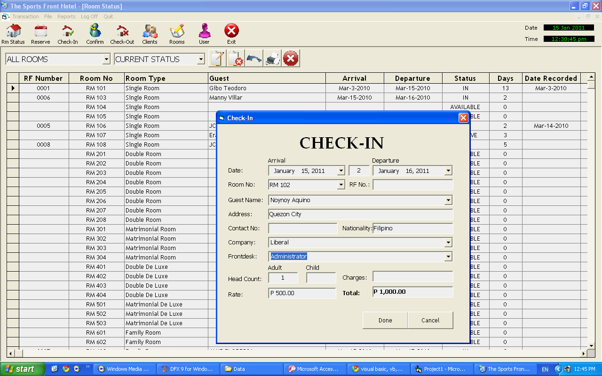



## Simple Hotel Booking Program

### Description

A simple Hotel Booking Program. With its basic tasks: Reservation, Check-In, Check-out,

an informative Room Status screen, and Reports.
 
### More Info
 

             |
---                |---
**Submitted On**   |2010-11-18 13:33:48
**By**             |[rashT](https://github.com/Planet-Source-Code/PSCIndex/blob/master/ByAuthor/rasht.md)
**Level**          |Advanced
**User Rating**    |5.0 (10 globes from 2 users)
**Compatibility**  |VB 6\.0, VBA MS Access
**Category**       |[Databases/ Data Access/ DAO/ ADO](https://github.com/Planet-Source-Code/PSCIndex/blob/master/ByCategory/databases-data-access-dao-ado__1-6.md)
**World**          |[Visual Basic](https://github.com/Planet-Source-Code/PSCIndex/blob/master/ByWorld/visual-basic.md)
**Archive File**   |[Simple\_Hot2196021142011\.zip](https://github.com/Planet-Source-Code/rasht-simple-hotel-booking-program__1-73683/archive/master.zip)

